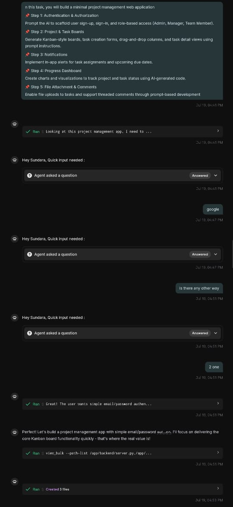
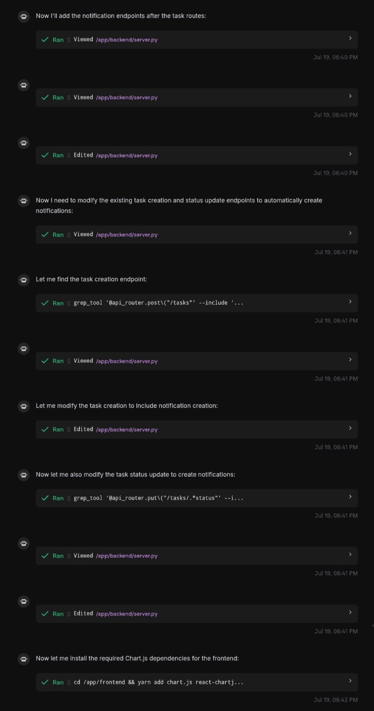

# 📝 Project Implementation Summary with Screenshots

**Description:**  
Added notification endpoints and modified task routes.

---

**Description:**  
Outlined full implementation plan including notifications, dashboard, and attachments.

---

**Description:**  
Explored backend/frontend structure, dependencies, and setup.

---

**Description:**  
Suggested implementation sequence and verified existing features.

---

**Description:**  
Demo credentials and sign-in guide for project access.

---

**Description:**  
Added `/users` endpoint, fixed team access logic, verified workflow.

---

**Description:**  
Implemented task creation restrictions, role-based permissions, and frontend error feedback.

---

**Description:**  
Verified team feature testing and frontend integration.

---

**Description:**  
Final status: Team workflows, file access, and comments enabled and verified.

---
